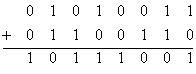
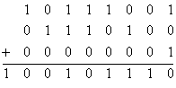
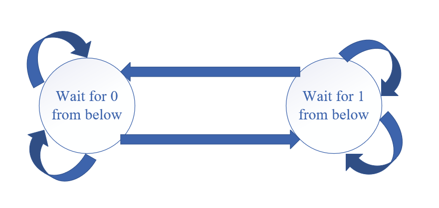

# Week6 HomeWork

## Chapter3 P3

#### Problem:

UDP and TCP use 1s complement for their checksums. Suppose you have the following three 8-bit bytes: 01010011, 01100110, 01110100. 

- What is the 1s complement of the sum of these 8-bit bytes? (Note that although UDP and TCP use 16-bit words in computing the checksum, for this problem you are being asked to consider 8-bit sums.) Show all work. 
- Why is it that UDP takes the 1s complement of the sum; that is, why not just use the sum? With the 1s complement scheme.
- How does the receiver detect errors? 
- Is it possible that a 1-bit error will go undetected? 
- How about a 2-bit error?

#### Solution:

1. The sum of these 8-bit bytes is calculated as follows:

   

   As we can see, the result overflows, so we have to wrap around 1 to the next calculation.

   

   so the 1's complement = $1101001$

2. In order to detect errors, the receiver add the three original words and the checksum.

3. The receiver will detect error is the sum contains a zero

4. All 1-bit errors will be detected, so it's impossible

5. Two-bit error may be undetected. For example, the last digit of the first word is converted to 0 and the last digit of the second word is converted to 1.

## Chapter3 P8

#### Problem:

Draw the FSM for the receiver side of protocol rdt3.0.

#### Solution:

The sender transmits the packet and the receiver acknowledges it by sending an ACK and confirms the packet is received.

The rdt3.0 protocol allows duplicate packets into the sender-to-receiver data stream by adding timeout. This is not possible in rdt2.0.

FSM diagram for the receiver side of the protocol rdt3.0 is follows:

